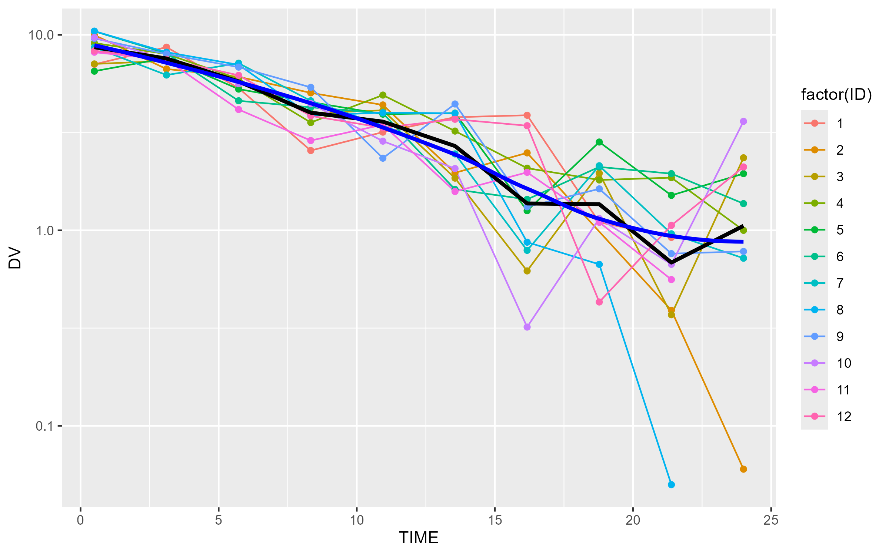

# 📦 Pharmacometric R Demo: Theophylline PK Project

## 🧪 Project Overview
This project demonstrates a complete pharmacometric workflow using R:
- Simulate and clean population PK data
- Visualize concentration-time profiles
- Prepare NONMEM-ready datasets
- Use Git/GitHub for reproducible project management

The dataset used is based on a **simulated Theophylline PK study** 
with 12 subjects.

------------------------------------

## 📁 Project Structure
/data → Raw input data (theophylline.csv)
/scripts → R scripts for data loading, cleaning, plotting
/output → Cleaned CSV, saved PNG plots, exported final dataset
/models → (Planned) NONMEM control stream and output
/report → (Planned) Model summaries and write-up

-----------------------------------------

## 🧰 Tools & Packages Used
- **R packages**: `readr`, `dplyr`, `ggplot2`
- **Skills**: data wrangling, log transformation, PK visualization, Git
- **GitHub**: version control, commits, push/pull tracking

## 📈 Example Plot

---------------------------------------------------------------

## 🧠 Key Learnings
- Visualizing variability in PK profiles across subjects
- Preparing structured data for MIDD workflows
- Interpreting log-transformed PK plots
- Using Git/GitHub for reproducibility in modeling projects

----------------------------------------------------------

## 👩‍💻 About Me
I'm Narumol Sukcharoen, an MSc student in Drug Discovery & Development, specializing in Model-Informed Drug Development (MIDD).  
This portfolio project is part of my preparation for roles in pharmacometrics and modeling in the pharma industry.

> 🔗 Contact: naruemol.0424@gmail.com  
> 💼 GitHub: [github.com/nacha-suk](https://github.com/nacha-suk)
